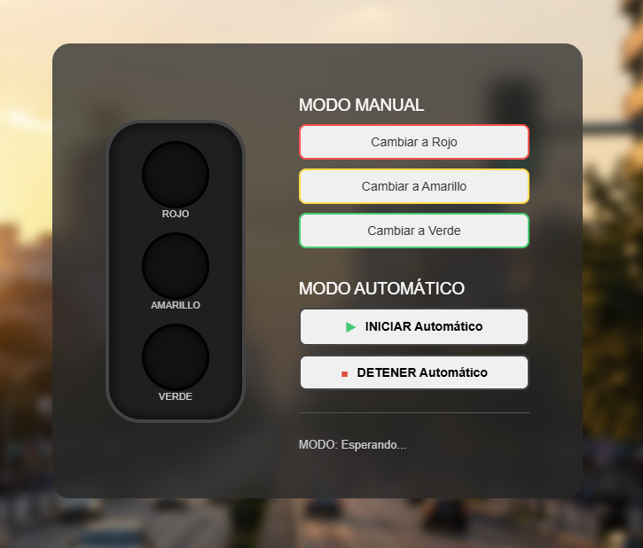

# Simulador de Semaforo.

**Programación III - UTN | Primer parcial (grupo 17)**

<p align="center">
  
</p>

---

## Descripcion.
Este proyecto consiste en el desarrollo de un simulador de semáforo utilizando **HTML, CSS (Flexbox) y JavaScript**.  

Permite controlar los estados del semáforo de forma manual y automática, simulando el funcionamiento real de un sistema de tránsito.

---

## Integrantes - Grupo 17.
- Jano Rodriguez.
- Luca Aversano.
- Dino Detzel.
- Joaquin Robles.
- Owen Braggi Bamberger Carrasco.
- Garcia Amado Juan Manuel. 

---

## Demo.
Podés ver el proyecto funcionando acá: 
---->  https://dinodetzel.github.io/prog3-2026-parcial1-g17/

---

## Funcionalidad.
### Modo Manual.
- Botón para encender luz **roja**  
- Botón para encender luz **amarilla**  
- Botón para encender luz **verde**
### Modo Automatico.
- Secuencia automática:  
**Rojo -> Verde -> Amarillo -> Rojo**  
- Botón **Iniciar** para activar el ciclo  
- Botón **Detener** para frenar la secuencia

---

## Lógica del sistema.
El semáforo funciona mediante un sistema de estados (`rojo`, `verde`, `amarillo`) almacenados en un array.  
  
En modo automático:  
- Se recorre la secuencia de colores de forma cíclica  
- Cada estado tiene un tiempo definido  
- Se utiliza `setTimeout` para controlar los cambios  
  
En modo manual:  
- Se detiene el ciclo automático  
- Se activa directamente el color seleccionado  
  
Se evita que existan múltiples ciclos activos al mismo tiempo.

---

## Tecnologias Utilizadas.
  
  


---

## Flujo de trabajo.

Se utilizó una estructura de ramas basada en Git:

- `main`: versión final estable del proyecto  
- `dev`: rama de integración  
- Ramas individuales por integrante (6 en total)  

Cada integrante trabajó en su propia rama y luego integró los cambios en `dev` mediante pull requests.  
Finalmente, la versión final fue unificada en la rama `main`.

---

## Instalación y uso.
1. Clonar el repositorio:  
```bash  
git clone https://github.com/DinoDetzel/prog3-2026-parcial1-g17
```
2. Abrir la carpeta del proyecto
3. Ejecutar el archivo `index.html` (No requiere instalacion adicional)

---

## Estructura del Proyecto.
    prog3-2026-parcial1-g17/
    │── index.html
    ├── assets/
    │   ├── img/
    │   └── favicon/
    ├── css/
    │   ├── index.css
    │   ├── components/
    │   |   ├── button.css
    │   |   ├── card-horizontal.css
    │   |   ├── controles.css 
    │   |   └── semaforo.css
    |   └── layout/
    |       ├── background.css
    |       ├── encabezado.css
    |       └── footer.css
    ├── js/                    
    │   └── script.js                     
    └── README.md

---

## Licencia.
Este proyecto es de uso académico.

---